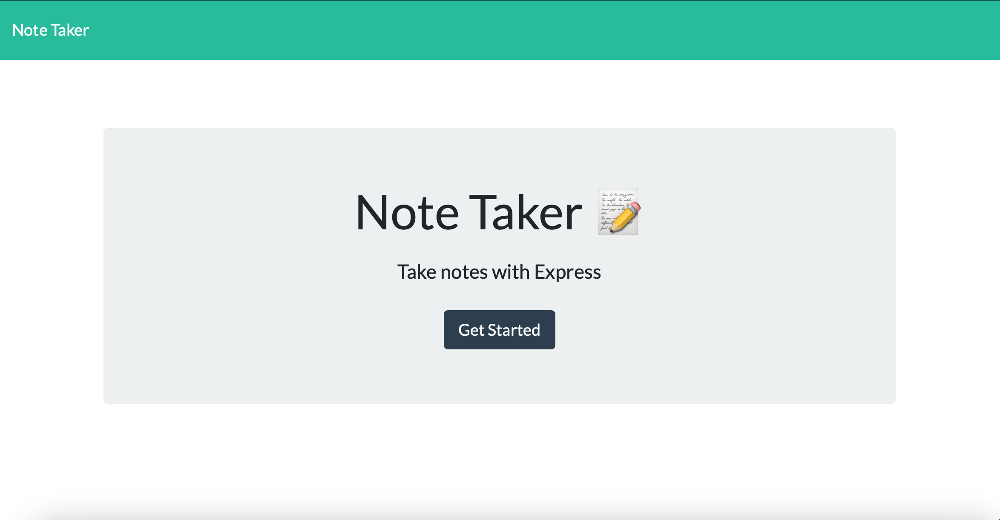

   

# 11.Note Taker

## Description
We had been learning how to use express to create our own server during the past week. This is the practice we use the skills of express to make server, by routing it to connet to front end code. I learn how to structure server by useing express and to connect them to the front end website. It was challenge to connect all of the parts correctly. Over all I enjoy the process of solving the quesion that comes up and building this note taker. 

## Usage

Website:

[Website link](https://jouan-note-taker.herokuapp.com)

 

## License
MIT 

## Badges

## Questions
        Please feel free to contact: 
        Github:https://github.com/anniechen9025/
        Email:anniechen9025@gmail.com
